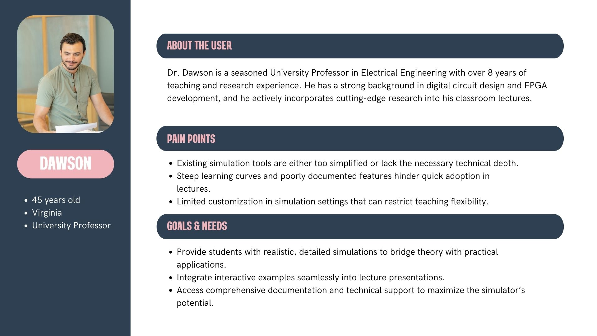
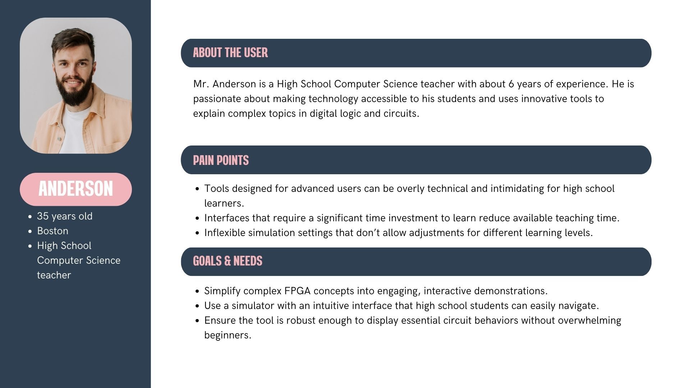
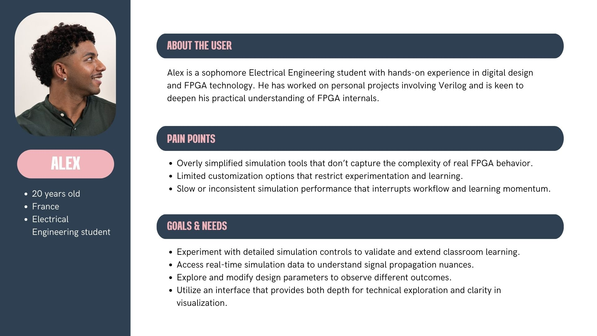
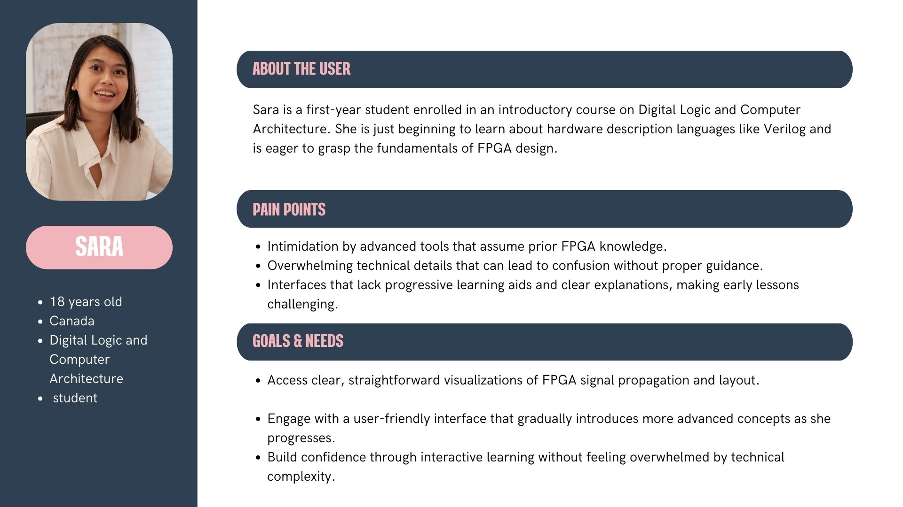
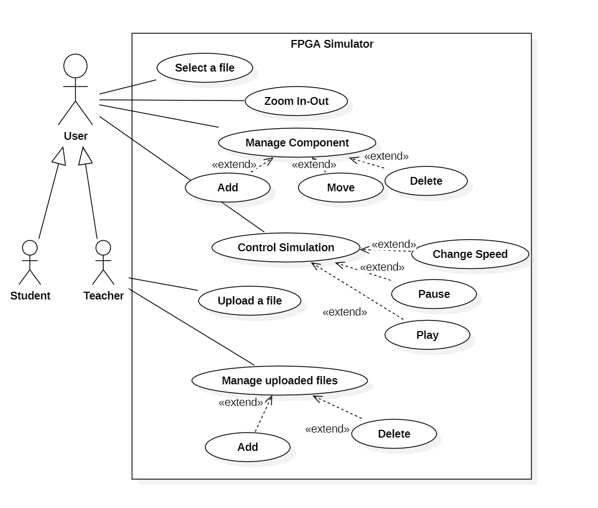
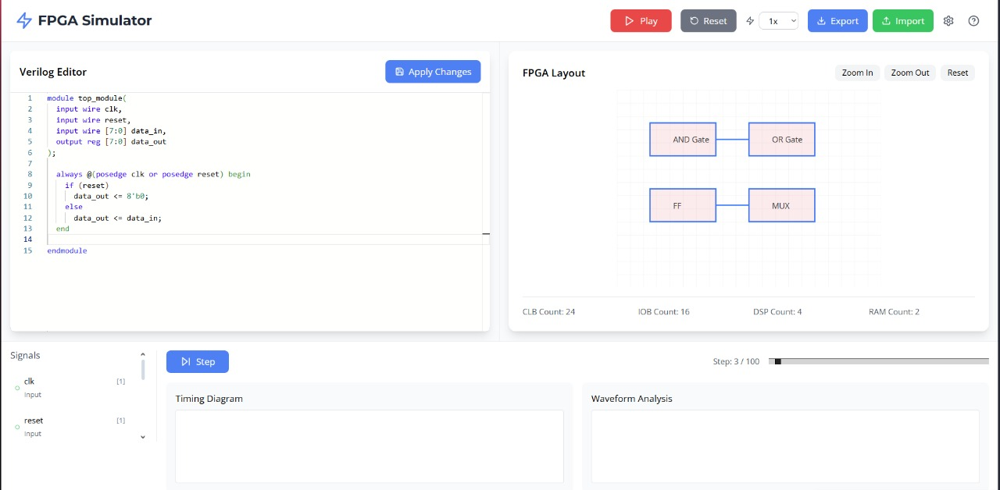
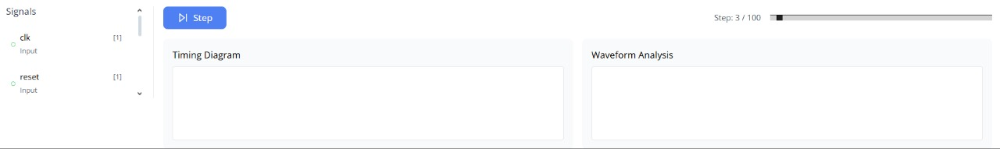
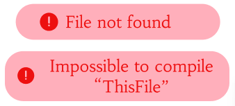

# Functional Specifications

Table of Contents

- [Functional Specifications](#functional-specifications)
  - [1. Introduction](#1-introduction)
    - [1.1. Project Overview](#11-project-overview)
      - [1.1.1. Problem Statement](#111-problem-statement)
    - [1.2. Project Definition](#12-project-definition)
      - [1.2.1. Vision](#121-vision)
      - [1.2.2. Objectives](#122-objectives)
      - [1.2.3. Scope](#123-scope)
      - [1.2.4. Target Audience](#124-target-audience)
      - [1.2.5. User Experience Goals](#125-user-experience-goals)
      - [1.2.6. Deliverables](#126-deliverables)
    - [1.3. Glossary](#13-glossary)
    - [1.4. Project Organization](#14-project-organization)
      - [1.4.1. Project Representatives](#141-project-representatives)
      - [1.4.2. Stakeholders](#142-stakeholders)
      - [1.4.3. Project Reviewers](#143-project-reviewers)
    - [1.5. Project Plan](#15-project-plan)
      - [1.5.1. Planning](#151-planning)
      - [1.5.2. Milestones](#152-milestones)
  - [2. User Interaction](#2-user-interaction)
    - [2.1. File Upload Process](#21-file-upload-process)
    - [2.2. File Processing Feedback](#22-file-processing-feedback)
    - [2.3. Simulation Controls](#23-simulation-controls)
    - [2.4. Visualization Interaction](#24-visualization-interaction)
  - [3. Personas and Use Cases](#3-personas-and-use-cases)
    - [3.1. Personas](#31-personas)
      - [3.1.1. Dr. Dawson](#311-dr-dawson)
      - [3.1.2. Mr. Anderson](#312-mr-anderson)
      - [3.1.3. Alex](#313-alex)
      - [3.1.4. Sara](#314-sara)
    - [3.2. Use Cases](#32-use-cases)
  - [4. UI Components \& Features](#4-ui-components--features)
    - [4.1. Main Interface Layout](#41-main-interface-layout)
    - [4.2. Control Panel](#42-control-panel)
    - [4.3. Visualization Area](#43-visualization-area)
    - [4.4. File Management](#44-file-management)
    - [4.5. MockUps](#45-mockups)
  - [5. Functional Requirements](#5-functional-requirements)
    - [5.1. Frontend Requirements](#51-frontend-requirements)
    - [5.2. Backend Requirements](#52-backend-requirements)
    - [5.3. Error Handling](#53-error-handling)
  - [6. Non-functional Requirements](#6-non-functional-requirements)
    - [6.1.  Performance \& Scalability](#61--performance--scalability)
    - [6.2. Usability \& Accessibility](#62-usability--accessibility)
    - [6.3. Compatibility \& Maintainability](#63-compatibility--maintainability)

## 1. Introduction

### 1.1. Project Overview

#### 1.1.1. Problem Statement

Understanding how signals propagate inside FPGAs presents a significant challenge for students and professionals alike. Traditional educational approaches often lack visual aids that connect theoretical concepts with practical implementation. This web-based FPGA simulator addresses this gap by providing an interactive, visual environment where users can observe and manipulate signal propagation in real-time.

By visualizing the internal workings of an FPGA, this application transforms abstract hardware concepts into tangible, observable processes. This bridges the gap between theory and application, making FPGA education more accessible and engaging.

### 1.2. Project Definition

#### 1.2.1. Vision

The primary goal of this project is to provide an educational and interactive tool for FPGA learners. By merging the 2D FPGA floorplan with real-time signal propagation, the web interface will help users understand and analyze FPGA behavior at both structural and timing levels. It will serve as a learning platform for students and a teaching aid for instructors.

#### 1.2.2. Objectives

- Develop a web-based application for visualizing FPGA signal propagation.
- Allow students to interact with the FPGA layout, selecting and analyzing predefined application examples.
- Provide real-time simulation controls, including play, step execution, speed adjustment, and pause/resume.
- Enable teachers to upload new application examples (Verilog designs and testbenches).
- Implement a backend processing system to generate necessary simulation data.
- Support two roles: teachers (backend data preparation) and students (frontend visualization and interaction).
- Deliver a functional prototype with at least two application examples (Flip-flop & LUT4).

#### 1.2.3. Scope

The project covers:

- **Frontend:** A web interface for students, displaying an interactive 2D view of the FPGA layout and signal propagation.
- **Backend:** A system allowing teachers to upload Verilog applications and testbenches, generating the required simulation data.
- **Visualization:** Graphical representation of FPGA elements (Basic Elements - BELs) and signal paths.
- **Simulation Control:** Features like zoom, pan, play, step execution, speed adjustment, and pause/resume.
- **Deliverables:** Source code, setup guides, user manuals, and at least two application examples.

#### 1.2.4. Target Audience

The application is designed for three primary user groups:

| User Group | Description | Primary Needs |
|------------|-------------|---------------|
| **Students** | Individuals learning FPGA concepts and design principles | Visual learning tools, intuitive interface, pre-loaded examples |
| **Teachers/Instructors** | Educators teaching FPGA concepts in classroom settings | Ability to upload custom examples, demonstration tools, monitoring student progress |
| **FPGA Professionals** | Engineers and developers working with FPGA technology | Quick visualization tools, debugging capabilities, advanced features |

Each user group brings unique requirements that shape the application's functionality and interface design.

#### 1.2.5. User Experience Goals

The application aims to deliver:

- **Intuitive Navigation**: A user interface that requires minimal training to operate effectively
- **Real-time Feedback**: Immediate visual response to user actions and file processing
- **Interactive Learning**: Ability to control simulation speed, step through processes, and observe changes
- **Self-Guided Exploration**: Tools that encourage experimentation and discovery
- **Accessibility**: Functions that work across different devices and for users with varying technical backgrounds

#### 1.2.6. Deliverables

| Deliverable               | Purpose                                                                                                                                         |
| ------------------------- | ----------------------------------------------------------------------------------------------------------------------------------------------- |
| Functional Specifications | Detailed documentation of the features used and their non-technical aspects.                                                                    |
| Technical Specifications  | Detailed documentation on the technical implementation of software.                                              
| Source Code           | The complete software implementation, including frontend, backend, and FPGA-related logic, with inline documentation.|
| Test Plan & Test Cases    | A structured set of test scenarios ensuring the accuracy, functionality, and efficiency of the FPGA simulator, covering frontend interactions, backend processing, and signal propagation validation. |
| User Manual               | End-user documentation covering installation, configuration, usage, troubleshooting, and maintenance.                                                                                                    |
| Example Applications               | EAt least two FPGA application examples (Flip-Flop & LUT4) to demonstrate functionality.

### 1.3. Glossary

| **Term**                      | **Definition**                                                                                                   |
| ----------------------------- | ----------------------------------------------------------------------------------------------------------------- |
| **FPGA (Field Programmable Gate Array)** | A reconfigurable integrated circuit that can be programmed to perform custom logic functions.            |
| **BEL (Basic Element)**        | Fundamental hardware components inside an FPGA, such as Flip-Flops, Look-Up Tables (LUTs), and Block RAMs.      |
| **Verilog**                    | A hardware description language (HDL) used to design and simulate digital circuits, including FPGA applications. |
| **Netlist**                    | A structural representation of an FPGA design that describes logic components and their connections after synthesis. |
| **SDF (Standard Delay Format)** | A file format that contains timing delay information for signals propagating inside an FPGA.                     |
| **Synthesis**                  | The process of converting a Verilog application into a netlist that maps logic operations to FPGA hardware elements. |
| **Place & Route (P&R)**         | The process of assigning FPGA resources to netlist components (**Place**) and determining electrical paths between them (**Route**). |
| **Testbench**                  | A Verilog file that provides test inputs and expected outputs to verify the functionality of an FPGA application through simulation. |
| **Simulator**                  | A tool that executes a Verilog testbench to model how signals propagate inside the FPGA over time.                 |
| **Frontend (Web Interface)**    | The graphical interface that allows students to select FPGA applications, visualize signal propagation, and control the simulation. |
| **Backend**                     | The server-side component responsible for processing Verilog files, generating simulation data, and providing preloaded FPGA applications. |
| **2D Floorplan View**           | A visual representation of the FPGA layout showing BELs and the routing of signals.                              |
| **Play Button**                 | A control in the web interface that starts the simulation, allowing users to see how signals propagate inside the FPGA. |
| **Step Button**                 | A control that advances the simulation by one step, showing signal changes incrementally.                          |
| **Pause/Resume Button**         | A control that stops or continues the simulation playback.                                                       |
| **Zoom & Move Controls**        | Interactive features that allow users to navigate within the FPGA floorplan visualization.                        |
| **Impulse**                     | A tool used for FPGA synthesis and place & route, converting Verilog designs into netlists and routing information. |
| **Modelism**                    | A simulation tool that executes Verilog testbenches and models timing-based signal propagation.                   |
| **Yosys**                       | An open-source synthesis tool that converts Verilog code into a netlist.                                          |
| **VPR (Verilog to Routing)**     | A toolchain for place & route in FPGA design, often used in open-source FPGA workflows.                         |
| **GTKWave**                     | A waveform viewer that displays simulation results from FPGA testbenches.                                        |
| **Teacher Role**                | The user responsible for uploading Verilog applications and testbenches to the backend for student simulations.  |
| **Student Role**                | The user who interacts with the web interface to explore FPGA applications and visualize signal propagation.      |
| **Pivot File Format**           | A possible intermediary data format used to bridge FPGA netlist and timing information between backend and frontend. |

### 1.4. Project Organization

#### 1.4.1. Project Representatives

| Full Name             | Role              | Role Description                                                                                                                                                     | Links to LinkedIn Profiles                                              |
| --------------------- | ----------------- | -------------------------------------------------------------------------------------------------------------------------------------------------------------------- | ----------------------------------------------------------------------- |
| Quentin CLEMENT         | Project manager   | Responsible for the overall planning, execution, and success of the project ensuring it meets scope, timeline, budget, and quality expectations.                                                                                        | [LinkedIn](https://www.linkedin.com/in/quentin-cl%C3%A9ment-939110221/)         |
| Mariem ZAIANE       | Program manager   | Responsible for the strategy, coordination, and successful delivery of the project.  Responsible for writing the Functional Specifications.                                     | [LinkedIn](https://www.linkedin.com/in/mariem-zaiane-2b2165225/)            |
| Victor LEROY | Tech lead         | Makes technical decisions for the project.   Translates the Functional Specification into Technical Specifications.   Does code review.                        | [LinkedIn](https://www.linkedin.com/in/victor-leroy-64baa3229/)       |
| David CUAHONTE      | Software engineer | focuses on coding, documentation, and collaborating on the design and development of software solutions.                                                                          | [LinkedIn](https://www.linkedin.com/in/david-cuahonte-527781221/)     |
| Pavlo PRENDI           | Quality assurance | Tests all the functionalities of a product to find bugs and issues.   Document bugs and issues.   Write the test plan.   Check that issues have been fixed. | [LinkedIn](https://www.linkedin.com/in/pavlo-prendi-674777309/)          |
|Mathis KAKAL       | Technical writer  | Responsible for creating and maintaining the project's documentation.                                                                                                | [LinkedIn](https://www.linkedin.com/in/mathis-k-a239ba10a/) |

#### 1.4.2. Stakeholders

| Role            | Representative | Expectations                                                           |
| --------------- | -------------- | ---------------------------------------------------------------------- |
| Customer      | Florent MANNI | Finished project meeting requirements                                  |
| School director | Franck JEANNIN | Clear documentation and management based on the skills learnt in class |

#### 1.4.3. Project Reviewers

External project reviewers have been appointed by the project owner to review our specifications and provide us with feedback.

### 1.5. Project Plan

#### 1.5.1. Planning

The planning process will follow a structured and sequential approach, ensuring clear deliverables and thorough documentation. While major phases will progress in order, some tasks—such as testing and frontend-backend integration—will be executed in parallel to optimize development time and ensure quality. Regular review checkpoints will be integrated to validate progress.

#### 1.5.2. Milestones

| Date         | Milestone                                                                                                                                                                                                                                                                    |
| ------------ | ---------------------------------------------------------------------------------------------------------------------------------------------------------------------------------------------------------------------------------------------------------------------------- |
| **28/02/25** |- Initial version of functional specifications  - Client meeting & technology selection                                                                                                                                                                                |
| **07/03/25** |-  Functional specifications refined - Draft of technical specifications  - QA setup & test plan initiation  - Code environment setup for frontend & backend                                                                        |
| **14/03/25** |- Final functional specifications - Technical specifications advanced  - Parsing verilog files  - Development & testing begins                  |
| **21/03/25** |-  Technical specifications refinement  - Test plan refinement  - UI development progress  - First draft of the user manual  - Code testing & debugging   |
| **28/03/25** |- Final technical specifications  - Continuous testing  - Further UI & backend improvements  - User manual refinement |
| **01/04/25** |- Code finalization  - Final testing & debug  - Final version of the User manual |

## 2. User Interaction

### 2.1. File Upload Process

Users can upload files through multiple methods:

1. **Direct Upload**: Standard file picker dialog
   - Single file upload
   - Multiple file upload option
   - Drag-and-drop support

2. **Example Selection**: Pre-loaded examples for immediate use
   - Categorized by complexity and concept
   - Brief descriptions to guide selection

### 2.2. File Processing Feedback

During and after file processing, users receive visual feedback:

- **Progress Indicators**: Shows file parsing and model generation progress
- **Success Notifications**: Confirms when files are successfully processed
- **Error Messages**: Clear explanations when issues occur, with suggested solutions
- **Processing Statistics**: Optional information about file size, processing time, and model complexity

The system maintains transparency throughout the processing pipeline, keeping users informed of the current state and any actions required.

### 2.3. Simulation Controls

Users interact with the simulation through an intuitive control panel:

| Control | Function | User Interaction |
|---------|----------|------------------|
| Play | Start or resume simulation | Button click |
| Pause | Temporarily stop simulation | Button click |
| Step | Advance simulation by one time unit | Button click |
| Speed | Adjust simulation playback rate | Slider or dropdown |
| Reset | Return to initial state | Button click |
| Time Scrubber | Navigate to specific simulation time | Draggable slider |
| Zoom | Adjust visualization scale | Slider, buttons, or mouse wheel |
| Pan | Navigate around the visualization | Click and drag |

These controls provide precise management of the simulation experience, allowing for detailed examination of signal propagation.

### 2.4. Visualization Interaction

The visualization area supports rich interaction:

- **Component Selection**: Click on FPGA elements to view detailed information
- **Signal Tracing**: Highlight specific signals to follow their path through the FPGA

## 3. Personas and Use Cases

### 3.1. Personas

#### 3.1.1. Dr. Dawson

#### 3.1.2. Mr. Anderson

#### 3.1.3. Alex

#### 3.1.4. Sara

### 3.2. Use Cases

The following use case diagram illustrates the interactions between users and the system.

## 4. UI Components & Features

### 4.1. Main Interface Layout

The interface follows a logical layout with distinct functional areas:

  <pre style="font-family: monospace; text-align: left; display: inline-block;">
┌─────────────────────────────────────────────────┐
│                  Header/Navigation              │
├─────────────┬───────────────────────────────────┤
│             │                                   │
│             │                                   │
│   File      │                                   │
│   Explorer  │         Visualization Area        │
│   &         │                                   │
│   Options   │                                   │
│             │                                   │
│             │                                   │
├─────────────┴───────────────────────────────────┤
│                                                 │
│               Simulation Controls               │
│                                                 │
└─────────────────────────────────────────────────┘
  </pre>

- **Header/Navigation**: Application name, user controls, help access
- **File Explorer**: File upload, selection, and management
- **Visualization Area**: FPGA component rendering and interaction
- **Simulation Controls**: Playback and time navigation controls

### 4.2. Control Panel

The control panel provides access to all simulation functions:

1. **Playback Controls**
   - Play/Pause button with appropriate icon changes
   - Step forward button with keyboard shortcut
   - Speed control with preset options (0.5x, 1x, 2x, 4x, 10x)
   - Reset button with confirmation for safety

2. **Navigation Controls**
   - Time slider showing full simulation timeline
   - Current time indicator with numerical display
   - Zoom controls with percentage display
   - Pan reset button to return to default view

### 4.3. Visualization Area

1. **2D Floorplan View**
   - Physical layout of FPGA components
   - Routing paths between components
   - Color-coded signal states
   - Zoom levels from overview to component detail

### 4.4. File Management

The file management interface allows users to:

1. **Upload Files**
   - Drag-and-drop area with clear instructions
   - File browser button for traditional selection
   - Format specifications and size limits clearly indicated

2. **Manage Existing Files**
   - List view of uploaded files with key metadata
   - Delete option with confirmation
   - Ability to rename files for organization

### 4.5. MockUps

**Display of the whole page:**

**Most important components of the page:**

| Screenshot | Component Name      | Description |
|------------|--------------------|-------------|
|  | **Play** | Starts the simulation. |
|  | **Reset** | Resets the simulation to its initial state. |
|  | **Speed** | Adjusts the speed of the simulation. |
|  | **Import** | Loads an external Verilog file. |
|  | **Export** | Saves the current Verilog code or simulation. |
|  | **Simulation Part** | Displays the simulation. |
|  | **Error Message** | Displays error messages when there is an issue. |
|  | **Confirmation Message** | Provides confirmation prompts for user actions. |

## 5. Functional Requirements

### 5.1. Frontend Requirements

1. **File Handling**
   - Accept .sdf and .v file uploads through drag-and-drop or file picker
   - Validate file formats before submission to backend
   - Display file metadata and status

2. **Visualization**
   - Render FPGA components based on JSON model data
   - Support zooming from overview to detailed component view
   - Enable panning across the visualization area
   - Highlight active components and signals during simulation

3. **Simulation Control**
   - Implement playback controls (play, pause, step)
   - Support variable simulation speeds (x1, x2, x4, etc.)
   - Provide reset functionality to return to initial state
   - Display current simulation time and progress

4. **User Interface**
   - Implement responsive design for different screen sizes
   - Support keyboard shortcuts for common actions
   - Provide tooltips and help information for all controls

### 5.2. Backend Requirements

1. **File Processing**
   - Parse .sdf files to extract timing information
   - Parse .v files to understand FPGA structure and logic
   - Validate file integrity and compatibility
   - Process files asynchronously to maintain UI responsiveness

2. **Model Generation**
   - Create structured JSON models from parsed file data
   - Include component physical locations for 2D rendering
   - Include timing information for simulation playback

3. **API Endpoints**
   - Implement file upload endpoint with multipart/form-data support
   - Provide model retrieval endpoint for processed data
   - Include status endpoint for checking processing progress
   - Implement error reporting endpoint for client-side issues

4. **Performance**
   - Optimize file parsing for memory efficiency
   - Implement streaming processing for large files
   - Support cancellation of long-running operations
   - Include progress reporting for extended processing tasks

### 5.3. Error Handling

1. **Client-Side Errors**
   - Validate file formats before upload
   - Handle network connectivity issues gracefully

2. **Server-Side Errors**
   - Return structured error responses with clear messages
   - Include error codes for programmatic handling

3. **User Feedback**
   - Display friendly messages for 404 (resource not found) errors
   - Show helpful guidance for 500 (server error) situations
   - Indicate validation errors before submission
   - Provide contextual help based on error type

## 6. Non-functional Requirements

### 6.1.  Performance & Scalability

   - The web interface should provide smooth rendering and responsive navigation (zoom, pan, select).
   - Simulation playback should support adjustable speeds (x1, x2, x4, etc.) and step-by-step execution.
   - Backend processing (synthesis, P&R, and simulation) should handle large FPGA designs efficiently.
   - The system must support multiple concurrent users (students & teachers) without significant slowdown.

### 6.2. Usability & Accessibility

   - The UI should be intuitive and visually clear, ensuring students with limited FPGA experience can navigate easily.
   - Playback controls (play, pause, step, speed adjustment) should be easy to access and use.
   - The system should be accessible from any modern web browser (Chrome, Firefox, Edge, etc.).

### 6.3. Compatibility & Maintainability

   - The system must support standard Verilog and SDF formats for FPGA netlists and timing data.
   - It should be interoperable with Impulse, Yosys, VPR, and ModelSim.
   - The codebase should be modular and well-documented, allowing future FPGA models and features to be added easily.
